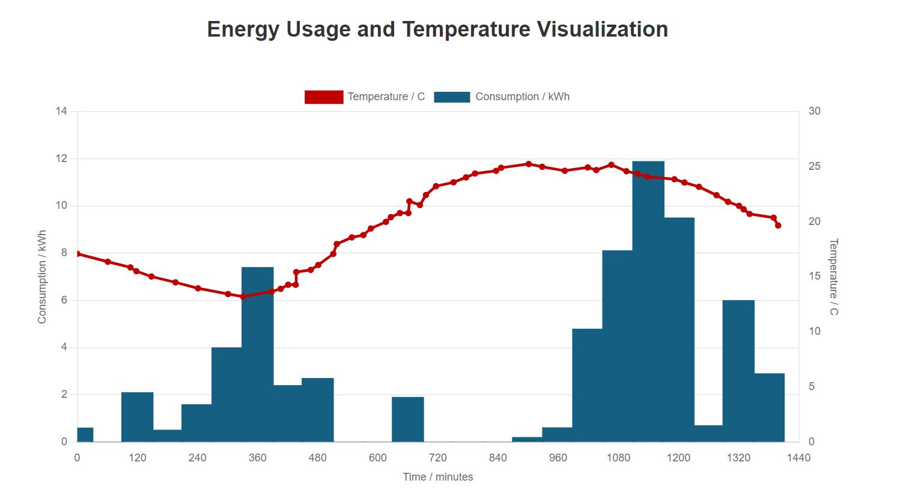

# Janus Technology Interview Task
## Energy Usage and Temperature Data Visualisation

### Overview

This project is a React application designed to visualise energy usage and temperature data over time through interactive charts. It empowers users to gain insights into their energy usage patterns and observe how these patterns correlate with temperature over time. The application provides a visualization of both energy consumption (in kWh) temperature (in degrees Celsius) over time (in minutes) on a single graph. The data is sourced from a JSON file, and the graph combines a line chart to display temperature and a bar chart to show hourly energy consumption, both plotted against time from midnight to midnight.

The graph uses dual Y-axes: one for energy consumption and one for temperature. The X-axis represents time of day in minutes (0 to 1440), where 810 minutes would correspond to 1:30 PM.

The temperature data is sparse and not recorded at consistent intervals, while energy consumption is measured hourly. The visualization allows users to easily interpret and analyse hourly energy consumption alongside temperature over time on the same graph. The final combination graph for temperature and consumption with two Y-axis is rendered is as below:

### Functionality

- Line Graph for Temperature: Displays temperature values on a continuous line. The Y-axis for temperature is scaled in degrees Celsius.

- Bar Chart for Energy Consumption: Displays hourly energy consumption as bars. The Y-axis for energy is scaled in kWh.

- Dual Y-Axis Scales: The graph utilizes two Y-axes to allow simultaneous visualization of both datasets.

- Dynamic Data Loading: The data is loaded from a JSON file, which contains both temperature and energy consumption information with time in minutes.

### Implementation

This project was implemented in VS Code and Gitpod using React and Chart.js (through the react-chartjs-2 library). The app dynamically fetches data from a provided JSON file and plots it using a combined line and bar chart. Implementation steps are as follows:

1. Installed Node.js
2. Create a New Project and repository
4. Create a react app:
    - `npx create-react-app data-visualisation-app`
    - `cd data-visualisation-app`
5. Installed necessary dependencies for using chart.js library:
    - `npm install react-chartjs-2 chart.js`
6. Create the necessary components files and folders.
7. Run the project:
    - `npm start`

            
### Technologies Used
- VS Code and Gitpod: To implement application. 
- React: JavaScript library to create the user interface.
- Chart.js: A JavaScript library for data visualization, utilized via react-chartjs-2 to render the charts.
- JavaScript: For logic and interactivity.

### Component Breakdown

The project consists of components that render charts using the `react-chartjs-2` and `chart.js` libraries. The main focus is on presenting energy consumption and temperature data effectively on a single chart (line and bar graph).

- App.js: The main component that fetches data from the JSON file and renders the EnergyTemperatureGraph component.
- EnergyTemperatureGraph.js: Handles rendering the dual-axis chart (temperature as a line graph and consumption as a bar chart over time).
- chartdatautils.js: A utility module containing helper functions to prepare datasets, generate time labels, and configure chart options.

### Setup Instructions

**1. Running from a Compressed Folder:**

   If you have downloaded this project as a compressed folder (ZIP, RAR, etc.):

- Extract the Folder: Unzip or extract the contents of the compressed folder.

- Navigate to the Project Directory: Open a terminal and navigate to the project directory where the package.json file is located.
    - `cd data-visualisation-app`

- Install Dependencies: Use npm to install all the required dependencies.
    - `npm install`

- Run the Application: Start the development server to view the project in your browser.
    - `npm start`

- Open in Browser: By default, the project will be available at `https://localhost:3000` in your browser.

**2. Running from a GitHub Repository:**

  To set up and run the project from a GitHub repository - Clone the repository:

- On Github navigate to the repository `https://github.com/gayatrig19/data-visualisation-app`
- Click "Code" drop down menu - a green button shown right above the file list.
- Copy the URL of the repository using "HTTPS", "SSH" or "Github CLI".
- Open Git Bash.
- Change the current working directory to the location where you want the cloned directory.
- Type "git clone", and then paste the URL copied earlier.
- Press enter to create local clone. A clone of the repository will now be created.
- Navigate to the Project Directory: After cloning, navigate to the project directory.
- Install Dependencies: Run the following command to install all dependencies.
    - `npm install`

- Run the Application: Start the development server. By default, the project will be available at `https://localhost:3000` in your browser.
    - `npm start`

### Version Control

Code has been pushed to repository on Github with following git commands:

- `git add .` - to add files ready to commit
- `git commit -m "message"` - to commit the code to local repository ready to be pushed
- `git push` - final command used to push committed code to remote repo on Github

### Forking

- On Github navigate to the repository.
- Click "Fork" located towards top right corner on GitHub page.
- Select "owner" for the forked repository from the dropdown menu under "owner".
- It will create forked repo under the same name as original by default. But you can type a name in "Repository name" or add a description in "Description" box.
- Click on "Create fork". A forked repo is created.

### Acknowledgement
Thank you for the opportunity to present this solution. It is developed with the aim to fulfill the task requirements in a simple and efficient way. 
